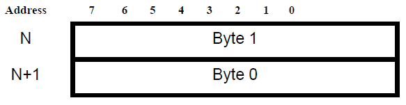
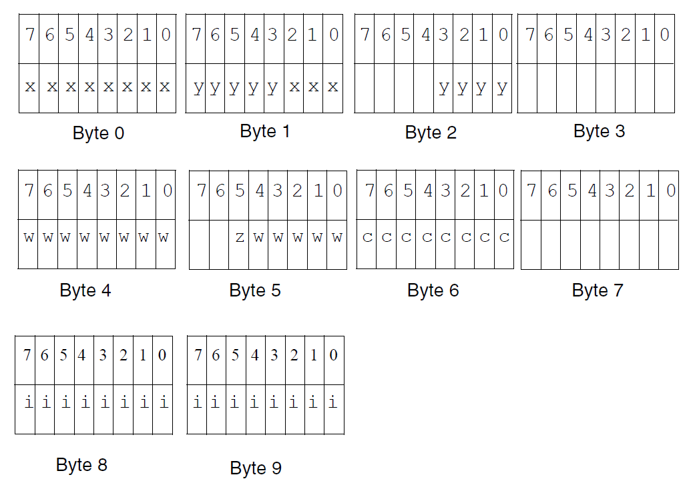

.. _low_lvl:

Low-Level System Information
============================

Machine Interface 
-----------------

Processor Architecture
~~~~~~~~~~~~~~~~~~~~~~

Programs intended to execute on ARCv2-based processors use the ARCv2 
instruction set and the instruction encoding and semantics of 
the architecture.

Assume that all instructions defined by the architecture are neither 
privileged nor exist optionally and work as documented.
 
To conform to ARCv2 System V ABI, the processor must do the following:

 - implement the instructions of the architecture, 
 - perform the specified operations, 
 - produce the expected results. 
 
The ABI neither places performance constraints on systems nor specifies 
what instructions must be implemented in hardware. A software emulation 
of the architecture can conform to the ABI.

.. caution::

   Some processors might support optional or additional instructions 
   or capabilities that do not conform to the ARCv2 ABI. Executing programs 
   that use such instructions or capabilities on hardware that does not have 
   the required additional capabilities results in undefined behavior.
..

Data Representation
~~~~~~~~~~~~~~~~~~~

Byte Ordering
^^^^^^^^^^^^^

The architecture defines an eight-bit byte, a 16-bit halfword, 
a 32-bit word, and a 64-bit double word. Byte ordering defines how 
the bytes that make up halfwords, words, and doublewords are ordered 
in memory. 

Most-significant-byte (MSB) ordering, also called as “big-endian”, 
means that the most-significant byte is located in the lowest addressed 
byte position in a storage unit (byte 0). 

Least-significant-byte (LSB) ordering, also called as “little-endian”, 
means that the least-significant byte is located in the lowest addressed 
byte position in a storage unit (byte 0).

ARCv2-based processors support either big-endian or little-endian byte 
ordering. However, this specification defines only the base-case 
little-endian (LSB) architecture. 

:numref:`bit_byte_num_hw` through :numref:`bit_byte_num_dw` illustrate the conventions for bit and byte 
numbering within storage units of varying width. These conventions 
apply to both integer data and floating-point data, where the 
most-significant byte of a floating-point value holds the sign and 
at least the start of the exponent. The figures show byte numbers 
in the upper right corners, and bit numbers in the lower corners. 

.. _bit_byte_num_hw:

   Bit and Byte Numbering in Halfwords
..

.. _bit_byte_num_w:  

   
   Bit and Byte Numbering in Words  
..

.. _bit_byte_num_dw:

   
   Bit and Byte Numbering in Doublewords
..

Data Layout in Memory
^^^^^^^^^^^^^^^^^^^^^

ARCv2-based processors access data memory using byte addresses and 
generally require that all memory addresses be aligned as follows:

- 64-bit double-words are aligned to 32-bit word boundaries.

- 32-bit words are aligned to 32-bit word boundaries.

- 16-bit halfwords are aligned to 16-bit halfword boundaries.

Bytes have no specific alignment.

Sixty-Four-Bit Data
'''''''''''''''''''

:numref:`64b_reg_LE` shows the little-endian representation in byte-wide memory. 
If the ARCv2-based processor supports big-endian addressing, the data 
is stored in memory as shown in :numref:`64b_reg_BE`.   

.. _64b_reg_LE:

   
   Sixty-Four-Bit Register Data in Byte-Wide Memory, Little-Endian
..

.. _64b_reg_BE:  

   
   Sixty-Four-Bit Register Data in Byte-Wide Memory, Big-Endian   
..

Thirty-Two-Bit Data
'''''''''''''''''''

:numref:`reg_32b` shows the data representation in a general purpose register.
 
.. _reg_32b:

   
   Register Containing Thirty-Two-Bit Data  
..

:numref:`32b_LE` shows the little-endian representation in byte-wide memory. 

.. _32b_LE:

   
   Thirty-Two-Bit Register Data in Byte-Wide Memory, Little-Endian  
..

:numref:`32b_BE` shows the big-endian representation.

.. _32b_BE:

   
   Thirty-Two-Bit Register Data in Byte-Wide Memory, Big-Endian  
..

Sixteen-Bit Data
''''''''''''''''

:numref:`reg_16b` shows the 16-bit data representation in a 
general purpose register.

For the programmer's model, the data is always contained in the 
lower bits of the core register and the data memory is accessed 
using a byte address. This model is sometimes referred to as a 
data invariance principle. 

.. _reg_16b:

   
   Register Containing Sixteen-Bit Data  
..

:numref:`16b_LE` shows the little-endian representation of 
16-bit data in byte-wide memory. 

.. _16b_LE:

   
   Sixteen-Bit Register Data in Byte-Wide Memory, Little-Endian  
..

:numref:`16b_BE` shows the big-endian representation.

.. _16b_BE:

   
   Sixteen-Bit Register Data in Byte-Wide Memory, Big-Endian  
..

Eight-Bit Data
''''''''''''''

:numref:`reg_8b` shows the 8-bit data representation in a general 
purpose register. For the programmer's model, the data is always 
contained in the lower bits of the core register and the data memory 
is accessed using a byte address. This model is sometimes referred 
to as a data invariance principle. 

.. _reg_8b:

   
   Register Containing Eight-Bit Data  
..

:numref:`8b_bw` shows the representation of 8-bit data in byte-wide memory.
Regardless of the endianness of the ARCv2-based system, the byte-aligned 
address, n, of the byte is explicitly given and the byte is stored or 
read from that explicit address.

.. _8b_bw:

   
   Eight-Bit Register Data in Byte-Wide Memory  
..

One-Bit Data
''''''''''''

The ARCv2 instruction-set architecture supports single-bit operations 
on data stored in the core registers. A bit manipulation instruction 
includes an immediate value specifying the bit to operate on. Bit 
manipulation instructions can operate on 8-bit, 16-bit, or 32-bit data 
located within core registers because each bit is individually addressable.

   
   Register Containing One-Bit Data  
..

Fundamental Types
^^^^^^^^^^^^^^^^^

:numref:`t_sc_types` shows how ANSI C scalar types correspond to those of ARCv2-based processors. 
For all types, a null pointer has the value zero. The **Alignment** column specifies 
the required alignment of a field of the given type within a struct. To align the variables more 
strictly than what is shown in :numref:`t_sc_types`, fields in a struct must follow the alignment 
specified to ensure consistent struct mapping.

.. _t_sc_types:
.. table:: Scalar Types History
   :class: longtable
   :widths: 30, 50, 20, 50, 130
  
   +---------------+-----------------------------+----------+---------------+-------------------------------+
   ||              ||                            ||         ||              ||                              |
   |  **Type**     |  **ANSI C**                 | **Size** | **Alignment** |   **ARCV2 based processors**  |
   |               |                             |          | (bytes)       |                               |    
   +===============+=============================+==========+===============+===============================+                  
   | Integral      || :code:`char`               |  1       |  1            | :code:`unsigned byte`         |
   |               || :code:`unsigned char`      |          |               |                               |     
   |               +-----------------------------+----------+---------------+-------------------------------+
   |               | :code:`signed char`         |  1       |  1            | :code:`signed byte`           |
   |               +-----------------------------+----------+---------------+-------------------------------+
   |               || :code:`short`              |  2       |  2            | :code:`signed halfword`       |
   |               || :code:`signed short`       |          |               |                               |
   |               +-----------------------------+----------+---------------+-------------------------------+
   |               | :code:`unsigned short`      |  2       |  2            | :code:`unsigned halfword`     |                   
   |               +-----------------------------+----------+---------------+-------------------------------+
   |               || :code:`int`                |  4       |  4            | :code:`signed word`           |
   |               || :code:`signed int`         |          |               |                               |
   |               || :code:`long`               |          |               |                               |
   |               || :code:`signed long`        |          |               |                               |
   |               +-----------------------------+----------+---------------+-------------------------------+
   |               || :code:`unsigned int`       |  4       |  4            | :code:`unsigned word`         |
   |               || :code:`unsigned long`      |          |               |                               |
   |               +-----------------------------+----------+---------------+-------------------------------+
   |               || :code:`long long`          |  8       |  4            | :code:`signed doubleword`     |
   |               || :code:`signed long long`   |          |               |                               |
   |               +-----------------------------+----------+---------------+-------------------------------+
   |               || :code:`unsigned long long` |  8       |  4            | :code:`unsigned doubleword`   |
   +---------------+-----------------------------+----------+---------------+-------------------------------+
   | Pointer       || :code:`any *`              |  4       |  4            | :code:`unsigned word`         |
   |               || :code:`any (*) *`          |          |               |                               |
   +---------------+-----------------------------+----------+---------------+-------------------------------+
   | Floating      | :code:`float`               |  4       |  4            | :code:`single precision`      |
   |               +-----------------------------+----------+---------------+-------------------------------+
   |               || :code:`double`             |  8       |  4            | :code:`double precision`      |
   |               || :code:`long double`        |          |               |                               |
   +---------------+-----------------------------+----------+---------------+-------------------------------+
   
Enumerations
^^^^^^^^^^^^

The enum data type mapping is similar to that of an integer of equivalent size. 
Signed integral types are used by default.

Complex Types
^^^^^^^^^^^^^

When passed as arguments, complex data types are 32-bit word-aligned.

Aggregates and Unions
^^^^^^^^^^^^^^^^^^^^^

Aggregates (structures, classes, and arrays) and unions assume the 
alignment of their most strictly aligned component, that is, the 
component with the largest alignment. The size of any object, including 
aggregates, classes, and unions, is always a multiple of the alignment 
of the object. Non-bitfield members always start on byte boundaries. 
The size of a struct or class is the sum of the sizes of its members, 
including alignment padding between members. The size of a union is the 
size of its largest member, padded such that its size is evenly divisible 
by its alignment. Enumerations can be mapped to one, two, or four bytes, 
depending on their size. An array uses the same alignment as its elements. 
Structure and union objects can be packed or padded to meet size and 
alignment constraints:

- An entire structure or union object is aligned on the same boundary as 
  its most strictly aligned member, though a packed structure or union need 
  not be aligned on word boundaries.

- Each member is assigned to the lowest available offset with the appropriate 
  alignment. Such alignment might require internal padding, depending on the 
  previous member.

- If necessary, a structure’s size is increased to make it a multiple of the 
  structure's alignment. Such alignment might require tail padding, depending 
  on the last member.

For detailed information on C++ classes, see “Storage Mapping for Class Objects ” see :ref:`stormap`

In the following examples, members’ byte offsets appear in the upper right corners.

Structure smaller than a word:  

.. code:: c

   struct {
     char c;
   };

..

   
   Byte-Aligned, Sizeof is 1  
..   

No Padding:

.. code:: c

   struct {
     char  c;
     char  d;
     short s;
     int   n;
   };   
..
  

   
   Word-Aligned, Sizeof is 8
..   

Internal Padding: 

.. code:: c
   
   struct {
     char  c;
     short s;
   };  
..

   
   Halfword-Aligned, Sizeof is 4  
.. 

Internal and Tail Padding:

.. code:: c

   struct {
     char   c;
     double d;
     short  s;
   };   
..

.. figure::  ../images/int_tail_padding.PNG
   :align: center
   
   Word-Aligned, Sizeof is 16
..

Union Allocation:

.. code:: c

   union {
     char  c;
     short s;
     int   j;
   };
..

   
   Word-Aligned, Sizeof is 4
..   

.. _stormap:

Storage Mapping for Class Objects
~~~~~~~~~~~~~~~~~~~~~~~~~~~~~~~~~

C++ class objects must be mapped in accordance with the GNU Itanium ABI; see the following URL: http://mentorembedded.github.io/cxx-abi/abi.html

Bitfields 
~~~~~~~~~

C/C++ struct and union definitions can have bitfields, defining integral 
objects with a specified number of bits.

Bitfields are signed unless explicitly declared as unsigned. For example, 
a four-bit field declared as int can hold values from -8 to 7.

:numref:`bitfield_types` shows the possible 
widths for bitfields, where w is maximum width (in bits).

.. _bitfield_types:
.. table:: Bitfield Types-Width and Range of Values
   :widths: 40, 30, 40 
  
   +------------------------------------+------------------------------+---------------------------------------------+
   |  **Bit Field Type**                | **Max Width** `w` **(Bits)** | **Range of Values**                         | 
   +====================================+==============================+=============================================+                  
   | :code:`signed char`                | 1 to 8                       | :math:`2^{(w-1)} - 1` to :math:`-2^{(w-1)}` |
   +------------------------------------+------------------------------+---------------------------------------------+
   | :code:`char` (default signedness)  | 1 to 8                       | 0 to :math:`2^w - 1`                        |
   +------------------------------------+------------------------------+---------------------------------------------+
   | :code:`unsigned char`              | 1 to 8                       | 0 to :math:`2^w - 1`                        |
   +------------------------------------+------------------------------+---------------------------------------------+
   | :code:`short`                      | 1 to 16                      | :math:`-2^{(w-1)}` to :math:`2^{(w-1)} - 1` |
   +------------------------------------+------------------------------+---------------------------------------------+
   | :code:`unsigned short`             | 1 to 16                      | 0 to :math:`2^w - 1`                        |
   +------------------------------------+------------------------------+---------------------------------------------+
   | :code:`int`                        | 1 to 32                      | :math:`-2^{(w-1)}` to :math:`2^{(w-1)} - 1` |
   +------------------------------------+------------------------------+---------------------------------------------+
   | :code:`long`                       | 1 to 32                      | :math:`-2^{(w-1)}` to :math:`2^{(w-1)} - 1` |
   +------------------------------------+------------------------------+---------------------------------------------+
   | :code:`enum` (unless signed values | 1 to 32                      | 0 to :math:`2^w - 1`                        | 
   | are assigned)                      |                              |                                             |
   +------------------------------------+------------------------------+---------------------------------------------+
   | :code:`unsigned int`               | 1 to 32                      | 0 to :math:`2^w - 1`                        |
   +------------------------------------+------------------------------+---------------------------------------------+
   | :code:`unsigned long`              | 1 to 32                      | 0 to :math:`2^w - 1`                        |
   +------------------------------------+------------------------------+---------------------------------------------+
   | :code:`long long int`              | 1 to 64                      | :math:`-2^{(w-1)}` to :math:`2^{(w-1)} - 1` |
   +------------------------------------+------------------------------+---------------------------------------------+
   | :code:`unsigned long long int`     | 1 to 64                      | 0 to :math:`2^w - 1`                        |
   +------------------------------------+------------------------------+---------------------------------------------+
..

Bitfields obey the same size and alignment rules as other structure and union members, 
with the following additions: 

- Bitfields are allocated from most to least significant bit on big-endian implementations. 

- Bitfields are allocated from least to most significant bit on little-endian implementations. 

- The alignment that a bit field imposes on its enclosing struct or union is the same as any 
  ordinary (non-bit) field of the same type. Thus, a bitfield of type int imposes a four-byte 
  alignment on the enclosing struct.

- Bitfields are packed in consecutive bytes, except if a bitfield packed in consecutive bytes 
  would cross a byte offset *B* where :code:`B % sizeof(FieldType) == 0`.
  
  In particular:

  - A bitfield of type :code:`char` must not cross a byte boundary.
  
  - A bitfield of type :code:`short` must not cross a halfword boundary.
  
  - A bit field of type :code:`int` must not cross a word boundary. 
  
  - Because long long ints are four-byte-aligned on ARCv2-based processors, a bitfield of type :code:`long 
    long` must not cross two word boundaries. Thus, field B in the following code would start on byte 4 
    of the parent struct: :code: `struct S { int A:8;  long long B:60; }`
    
You can insert padding as needed to comply with these rules. 

Unnamed bitfields of non-zero length do not affect the external alignment. In all other respects, 
they behave the same as named bitfields. An unnamed bitfield of zero length causes alignment to 
occur at the next unit boundary, based on its type.

The struct in the following example can be mapped as illustrated in or :numref:`struct_LE`.

.. code:: c

   struct {
      unsigned x:11, y:9, :0, w:13, z:1;
      char  c;
      short i;
      }
..

.. _struct_LE:

   
   Structure Mapped in Little-Endian Orientation
..   

The `struct` in :numref:`struct_LE` is aligned on address boundaries divisible by four because it contains 
:code:`int` types. Note that the unnamed bitfield (:0) forces padding, while alignment rules sometimes pad. 

If w were changed to a `char` type, it would still be forced to begin in byte four. If there were 
no unnamed bitfield, w would begin in byte two, three, or four, depending on whether it could fit 
in the space remaining without crossing its storage-unit boundary (which is four).

The following examples show the byte offsets of `struct` and `union` members in the upper right 
corners for little-endian implementations. Bit numbers appear in the lower corners.      

Bit numbering of :code:`0x01020304`:

   
   Bit Numbering
..   

Bit-Field Allocation:

.. code:: c

   struct {
     int j : 5;
     int k : 6;
     int m : 7;
   };
..

   
   Word-Aligned, Sizeof is 4
.. 

Boundary Alignment:

.. code:: c

   struct {
     short s : 9;
     int   j : 9;
     char  c;
     short t : 9;
     short u : 9;
     char  d;
   };
..

   
   Word-Aligned, Sizeof is 12
..    

Storage Unit Sharing:

.. code:: c

   struct {
     char  c;
     short s : 8;
   };
..

   
   Halfword-Aligned, Sizeof is 2
..

Union Allocation:

.. code:: c

   union {
     char  c;
     short s : 8;
   };
..

   
   Halfword-Aligned, Sizeof is 2
..

Unnamed Bitfields:

.. code:: c

   struct {
     char  c;
     int   : 0;
     char  d;
     short : 9;
     char  e;
   };
..

   
   Byte-Aligned, Sizeof is 9
..

.. note::
   In this example, the presence of the unnamed int and short fields does not affect the alignment 
   of the structure. They align the named members relative to the beginning of the structure, but 
   the named members might not be aligned in memory on suitable boundaries. For example, the d members 
   in an array of these structures are not all on an int (four-byte) boundary. Because there is no 
   named field with any alignment requirements beyond a byte, the struct is nine bytes wide, 
   one-byte aligned.       
..

Function Calling Sequence
-------------------------
 
This section discusses the standard function calling sequence, including stack-frame layout, register 
usage, and argument passing.

Programs must follow the conventions given here. For examples of approaches permissible within these 
conventions, see :ref:`coding_ex`.

.. _regs:

Registers 
~~~~~~~~~

The base-case processor hardware provides 32 word-sized (32-bit) registers and a number of special-purpose 
auxiliary registers. Auxiliary registers are used only by the LR and SR assembly instructions.

Core Registers
^^^^^^^^^^^^^^

:numref:`t_gen_pc_reg` and :numref:`t_aux_reg` summarize the registers and their functions in a standard 
processor build. If a reduced register set is specified, only four words of arguments are passed in 
registers: r0 through r3. In addition, registers r4-r9 and r16-r25 are not available with the reduced 
register set.

.. note:: 
   Alternatively, a compiler can be configured to pass 64-bit arguments only in even/odd register pairs. 
   In the example F(int a, long long b); argument a can be passed in r0, and argument b can be passed in 
   r2 and r3. Note that r1 is skipped so that the 64-bit value can reside in an even/odd pair if preceded 
   by a single 32-bit word.

   Code generated with such an argument-passing mechanism is not compatible with code emitted using the 
   mechanism described in :numref:`t_gen_pc_reg`. See your compiler documentation for compatibility options.
..

.. |--| unicode:: U+2013   .. en dash
.. |---| unicode:: U+2014  .. em dash

.. _t_gen_pc_reg:

.. table:: General and Program-Counter Register Functions
   :widths: 20, 50, 60 
  
   +---------------+--------------------------------+-------------------------------------------+
   | **Register**  | **Primary Function**           | **Secondary Function**                    | 
   +===============+================================+===========================================+                  
   | r0            | Integer result, Argument 1     | Caller-saved scratch register             |
   +---------------+--------------------------------+-------------------------------------------+
   | r1            | Argument 2                     | Caller-saved scratch register             |
   +---------------+--------------------------------+-------------------------------------------+
   | r2            | Argument 3                     | Caller-saved scratch register             |
   +---------------+--------------------------------+-------------------------------------------+
   | r3            | Argument 4                     | Caller-saved scratch register             |
   +---------------+--------------------------------+-------------------------------------------+
   | r4            | Argument 5                     | Caller-saved scratch register             |
   +---------------+--------------------------------+-------------------------------------------+
   | r5            | Argument 6                     | Caller-saved scratch register             |
   +---------------+--------------------------------+-------------------------------------------+
   | r6            | Argument 7                     | Caller-saved scratch register             |
   +---------------+--------------------------------+-------------------------------------------+
   | r7            | Argument 8                     | Caller-saved scratch register             |
   +---------------+--------------------------------+-------------------------------------------+ 
   | r8 |--| r12   | Caller-saved scratch register  | |---|                                     |
   +---------------+--------------------------------+-------------------------------------------+
   | r13 |--| r24  | Callee-saved register variable | |---|                                     |
   +---------------+--------------------------------+-------------------------------------------+
   | r25           | Callee-saved scratch register  | gcc reserves r25 as Thread pointer if     |
   |               |                                | Thread local storage is enabled           |
   +---------------+--------------------------------+-------------------------------------------+
   | r26           | Small-data base register (gp)  | |---|                                     |
   +---------------+--------------------------------+-------------------------------------------+ 
   | r27           | Frame pointer (fp)             | |---|                                     |
   +---------------+--------------------------------+-------------------------------------------+ 
   | r28           | Stack top pointer (sp)         | |---|                                     |
   +---------------+--------------------------------+-------------------------------------------+ 
   | r29           | Interrupt link register        | |---|                                     |
   +---------------+--------------------------------+-------------------------------------------+ 
   | r30           | General purpose register       | Caller-saved scratch register             |
   +---------------+--------------------------------+-------------------------------------------+  
   | r31           | Branch link register (blink)   | |---|                                     |
   +---------------+--------------------------------+-------------------------------------------+ 
   | r58           | Accumulator Low ACCL (little   | Caller-saved scratch register             |
   |               | endian), ACCH (big-endian)     |                                           |  
   +---------------+--------------------------------+-------------------------------------------+
   | r59           | Accumulator High ACCH (little  | Caller-saved scratch register             |
   |               | endian), ACCL (big-endian)     |                                           |  
   +---------------+--------------------------------+-------------------------------------------+
   | r60           | Loop counter (lp_count)        | Caller-saved scratch register             |
   |               |                                | (compilers only—not user code)            |  
   +---------------+--------------------------------+-------------------------------------------+ 
   | r62           | Long immediate data indicator  | |---|                                     |
   +---------------+--------------------------------+-------------------------------------------+  
   | r63           | program-counter value (pcl)    |                                           |   
   +---------------+--------------------------------+-------------------------------------------+                     
   
The pcl register (r63) contains the four-byte-aligned value of the program counter. 

The lp_count register (r60) is the 32-bit loop-counter register. It is not preserved across 
function calls, but you can change this behavior by including it in the registers specified 
with option :code:`-Hirq_ctrl_saved="regs"` or pragma :code:`irq_ctrl_saved("regs")`.

.. note:: 
   The scratch registers are not preserved across function calls. When calling an external 
   function, the compiler assumes that registers r0 through r12 and r30 are trashed; and 
   that r13 through r29 are preserved.  The EV6x processor reserves r25.
..

Auxiliary Registers
^^^^^^^^^^^^^^^^^^^

:numref:`t_aux_reg` summarizes the most commonly used auxiliary registers. Due to the large number of 
auxiliary registers possible on an ARC processor, this listing is necessarily incomplete, 
and might vary from one implementation to another. See the *Programmer’s Reference Manual* 
for a specific ARCv2-based processor for a complete listing of the auxiliary registers that 
can be implemented on that processor.

.. _t_aux_reg:

.. table:: Auxiliary-Register Functions  
   
    ===========  ==================================================================  
    **Address**  **Function**
    ===========  ==================================================================  
    0x2          Loop start address (lp_start)
    0x3          Loop end address (lp_end)
    0x4          Processor identification 
    0x5          debug 
    0x6          Program counter (nextpc) 
    0xa          Condition flags (status32) 
    0xb          Status save register for highest-priority interrupt (status32_p0)
    0xc          Unused
    0x21         Processor-timer-0 count value 
    0x22         Processor-timer-0 control value 
    0x23         Processor-timer-0 limit value 
    0x25         Interrupt-vector base address 
    0x68         Default vector-base build configuration 
    0x100        Processor-timer-1 count value 
    0x101        Processor-timer-1 control value 
    0x102        Processor-timer-1 limit value 
    0x201        Software interrupt 
    0x290        JLI table base register
    0x291        LDI table base register
    0x292        EI table base register
    0x400        Exception return address 
    0x401        Exception-return branch-target address 
    0x402        Exception-return status 
    0x403        Exception cause
    0x404        Exception-fault address
    0x410        User-mode extension enables
    0x412        Branch-target address
    0x413        Unused
    0x414        Unused    
    ===========  ==================================================================  
..    

The nextpc auxiliary register contains the program counter; the pcl register contains the 
4-byte aligned value of the program counter. The status32 auxiliary register contains the 
condition flags.

For information on which registers can be used by which 16-bit instructions, see the 
*Programmer’s Reference Manual* for each processor.

.. _stk_frame:

Stack Frame
~~~~~~~~~~~
 
This section describes the layout of the stack frame and registers that must be saved by 
the callee prolog code.
 
The Stack-Pointer Register
^^^^^^^^^^^^^^^^^^^^^^^^^^

The stack-pointer (sp) register always points to the lowest used address of the most recently 
allocated stack frame. The value of sp is a four-byte-aligned address. 

The stack-pointer register is commonly used as a base register to access stack-frame-based 
variables, which always have a positive offset. However, when alloca() is called, the 
stack-pointer register might be arbitrarily decremented after the stack frame is allocated. 
In such a case, the frame pointer register is used to reference stack-frame-based variables.

The Frame-Pointer Register
^^^^^^^^^^^^^^^^^^^^^^^^^^

The frame pointer register (fp) is used when a function calls alloca() to allocate space on 
the stack, and stack-frame-based variables must be accessed.

The Callee’s Prolog Code
^^^^^^^^^^^^^^^^^^^^^^^^

The callee’s prolog code saves all registers that need to be saved. Saved values include the 
value of the caller’s blink (return address) register, callee-saved registers used by the 
function, and the frame-pointer register, if required.
 
The caller's stack-pointer (sp) register does not need to be saved because the compiler is 
able to restore the stack pointer for each function to its original value (for example, by 
using an add instruction).

   
   Stack Frame for One Function Invocation
..    

Allocating Stack Space Dynamically
~~~~~~~~~~~~~~~~~~~~~~~~~~~~~~~~~~ 

Programs can dynamically grow the current stack frame using a memory-allocating function.
The memory-allocating function must maintain a frame pointer and the stack mechanics 
outlined in :ref:`stk_frame`  through :ref:`pro_epi_code`. The stack frame must 
be maintained using the frame pointer (fp) instead of the stack pointer (sp).

.. _arg_pass:

Argument Passing
~~~~~~~~~~~~~~~~ 

Arguments are passed as an ordered list of machine-level values from the caller to the callee.
 
- The first eight words (32 bytes) of arguments are loaded into registers r0 to r7. In builds 
  with a reduced register set, the first four words are loaded into r0 to r3.

- The remaining arguments are passed by storing them into the stack immediately above the 
  stack-pointer register. 

.. _ret_val:

Return Values 
~~~~~~~~~~~~~

Functions return the following results:

 - Any scalar or pointer type that is 32 bits or less in size (char, short, int, long) is 
   returned in r0.

 - Eight-byte integers (long long, double, and float complex) are returned in r0 and r1.

 - Results of type complex double are returned in r0 to r3.

 - Results of type complex float are returned in r0 and r1.

 - Results of type struct are returned in a caller-supplied temporary variable whose address 
   is passed in r0. For such functions, the arguments are shifted so that they are passed in 
   r1 and upwards.

Process Initialization 
----------------------

This Supplement does not define a process-initialization state. The processor begins executing 
code at a hard-coded location and initially has no stack; establishing the operating environment 
for processes and programs entails setting up a stack and methods for passing arguments and 
return values as described in :ref:`stk_frame`. 

The processor supports kernel and user operating modes to permit different levels of privilege 
to be assigned to operating system kernels and user programs, strictly controlling access to 
privileged system-control instructions and special registers. Kernel mode is the default mode 
from reset. For more information on the operating modes, see the *Programmer’s Reference Manual*.
 
The processor can be restarted by clearing the H bit in the STATUS32 register. On restart, the 
pipeline is flushed; interrupts are disabled; status register flags are cleared; the semaphore 
register is cleared; loop count, loop-start and loop-end registers are cleared; the scoreboard 
unit is cleared; the pending-load flag is cleared; and program execution resumes from the 32-bit 
address specified by the user as the first 32-bit entry in the interrupt-vector table, the reset 
vector. The core registers are not initialized except lp_count (which is cleared). A jump to the 
reset vector (a soft reset) does not pre-set any of the internal states of the processor. The 
reset value of the vector base register determines the reset vector address. 

.. note::
   User extensions and optimizations to this area are permitted. 

Operating System Interface 
--------------------------

Linux
~~~~~

OS ABI consists of system calls provided by Linux kernel and call upon by user space library code.

 - ABI is similar to a regular function call in terms of arguments passing semantics. For example, 
   64-bit data in register pairs.

 - Up to eight arguments allowed in registers r0 to r7.

 - Syscall number must be passed in register r8.

 - Syscall return value is returned back in r0.

 - All registers except r0 are preserved by kernel across the Syscall.

The current Linux OS ABI (v4.8 kernel onwards) is ABIv4. For information on the ABI versions, see 
https://github.com/foss-for-synopsys-dwc-arc-processors/linux/wiki/ARC-Linux-Syscall-ABI-Compatibility

.. _coding_ex:

Coding Examples 
---------------

This section discusses example code sequences for basic operations. 

.. _pro_epi_code:

Prolog and Epilog Code 
~~~~~~~~~~~~~~~~~~~~~~

A function’s prolog and epilog code establish the environment needed by the body of the function. 
This Supplement does not specify any particular prolog or epilog code, but provides the following 
suggested guidelines and examples; the only requirements of a function prolog are that it meet the 
expectations of the caller and callee, particularly as regards the passing of parameters.

- The prolog establishes a stack frame, if necessary, and can save any callee-saved registers the 
  function uses. 

- The epilog generally restores registers that were saved in the prolog code, restores the previous 
  stack frame, and returns to the caller.
  
In each of the prolog-code examples in this section, framesize is the size, in bytes, of the area 
needed for auto variables, spill temporaries, and saved registers.

Standard Prolog Code
^^^^^^^^^^^^^^^^^^^^

Standard prolog code performs the following tasks, in this order:

 #. Saves the return-address (blink) register on the stack.

 #. Saves any callee-saved registers that are modified by the function.

 #. Allocates any additional space required in the frame by decrementing the stack pointer 
    accordingly.

This is the standard prolog code:

.. code::
  
   ; Save return address register:
      push_s   %blink
   ; Save registers r13, r14, r15, and so on 
   ; (all callee-saved registers that must be saved):
      push_s   %r13
      push_s   %r14
      push_s   %r15
   : Allocate remainder of frame
      sub      %sp, %sp, additional_space
..
  
Abbreviated Prolog and Epilog
^^^^^^^^^^^^^^^^^^^^^^^^^^^^^

For a leaf function (that does not call other functions), a compiler can abbreviate the prolog 
and epilog, as long as it conforms to the ABI for globally accessed functions.

Data Objects 
^^^^^^^^^^^^

The transfer of data to and from memory is accomplished using load and store instructions. 

Volatile and Uncached Variables 
^^^^^^^^^^^^^^^^^^^^^^^^^^^^^^^

The run-time model permits variables to be designated as volatile or uncached. 

- A volatile variable is assumed to have a value that can asynchronously change, independent of 
  the thread that is referencing the variable. Thus it is not advisable to cache the value of 
  such variables or to attempt to optimize multiple accesses to them.

- Uncached variables are loaded and stored without using the processor’s data cache. Use .ucdata 
  section to store them separately.
  
Function Calls and Branching
^^^^^^^^^^^^^^^^^^^^^^^^^^^^

Programs might use one of several branch, jump, and link instructions to control execution flow 
through direct and indirect function calls and branching. For function calling, the conditional 
branch-and-link instruction has a maximum branch range of +/- 1 MB, and the target address is 
32-bit-aligned. The unconditional branch-and-link format has a maximum branch range of +/- 16 MB. 

See *Programmer’s Reference Manual* for your ARCv2-based processor for a list of instructions.

