.. _obj_files:

Object Files
============

ELF Header
----------

Machine Information
~~~~~~~~~~~~~~~~~~~

For file identification in `e_ident`, ARCv2-based processors require 
the following values:

   :code:`e_ident[EI_CLASS]`   :code:`ELFCLASS32`    For all 32-bit implementations
   
   :code:`e_ident[EI_DATA]`    :code:`ELFDATA2LSB`   If execution environment is little-endian
   
   :code:`e_ident[EI_DATA]`    :code:`ELFDATA2MS`    If execution environment is big-endian

Processor identification resides in the ELF header's e_machine member, 
and must have the value 195 (0xc3), defined as the name :code:`EM_ARCOMPACT2`.

Tools may use e_flags to distinguish ARCv2-based processor families, 
where 5 identifies the ARC EM processor family, and 6 identifies the 
ARC HS processor family.

The high bits are used to select the Linux OSABI: 

.. table:: Linux OSABI Selection
   
   =====    ==========  ============================
   0x000    OSABI_ORIG  v2.6.35 kernel (sourceforge)
   0x200    OSABI_V2    v3.2 kernel (sourceforge)
   0x300    OSABI_V3    v3.9 kernel (sourceforge)
   0x400    OSABI_V4    v24.8 kernel (sourceforge)
   =====    ==========  ============================
..

Special Sections 
----------------

Special Sections: Types and Attributes
~~~~~~~~~~~~~~~~~~~~~~~~~~~~~~~~~~~~~~

The sections listed in :numref:`t_sp_sec` are used by the 
system and have the types and attributes shown.

.. _t_sp_sec:

.. table:: Special Sections
   
   ==================  ============   =====================================================
   **Name**            **Type**       **Attributes**
   ==================  ============   =====================================================
   .arcextmap          SHT_PROGBITS   none
   .bss                SHT_NOBITS     SHF_ALLOC + SHF_WRITE
   .ctors              SHT_PROGBITS   SHF_ALLOC
   .data               SHT_PROGBITS   SHF_ALLOC + SHF_WRITE
   .fixtable           SHT_PROGBITS   SHF_ALLOC + SHF_WRITE
   .heap               SHT_NOBITS     SHF_ALLOC + SHF_WRITE
   .initdata           SHT_PROGBITS   SHF_ALLOC
   .offsetTable        SHT_PROGBITS   SHF_ALLOC + SHF_OVERLAY_OFFSET_TABLE + SHF_INCLUDE
   .overlay            SHT_PROGBITS   SHF_ALLOC + SHF_EXECINSTR + SHF_OVERLAY + SHF_INCLUDE
   .overlayMultiLists  SHT_PROGBITS   SHF_ALLOC + SHF_INCLUDE
   .pictable           SHT_PROGBITS   SHF_ALLOC
   .rodata_in_data     SHT_PROGBITS   SHF_ALLOC + SHF_WRITE
   .sbss               SHT_NOBITS     SHF_ALLOC + SHF_WRITE
   .sdata              SHT_PROGBITS   SHF_ALLOC + SHF_WRITE
   .stack              SHT_NOBITS     SHF_ALLOC + SHF_WRITE
   .text               SHT_PROGBITS   SHF_ALLOC + SHF_EXECINST
   .tls                SHT_PROGBITS   SHF_ALLOC + SHF_WRITE
   .ucdata             SHT_PROGBITS   SHF_ALLOC + SHF_WRITE
   .vectors            SHT_PROGBITS   SHF_ALLOC + SHF_EXECINST
   ==================  ============   =====================================================
..   

.. note::
   To be compliant with the ARCv2 ABI, a system must support `.tls`, 
   `.sdata`, and `.sbss` sections, and must recognize, but may choose 
   to ignore, .arcextmap and .stack sections.
..

Special Sections: Description
~~~~~~~~~~~~~~~~~~~~~~~~~~~~~~

The special sections are described in :numref:`t_spl_sec_desc` 

Special features might create additional sections. For details regarding 
overlay-related sections see the *Automated Overlay Manager User’s Guide*.

.. _t_spl_sec_desc:
.. table:: Special Section Description
   :widths: 40, 150 
   
   +---------------------+---------------------------------------------------------------------------------------------------------------+
   | **Special Section** |  **Description**                                                                                              |
   +=====================+===============================================================================================================+
   | .arcextmap          | Debugging information relating to processor extensions                                                        |
   +---------------------+---------------------------------------------------------------------------------------------------------------+
   | .bss                | Uninitialized variables that are not const-qualified (startup code normally sets .bss to all zeros)           |
   +---------------------+---------------------------------------------------------------------------------------------------------------+
   | .ctors              | Contains an array of functions that are called at startup to initialize elements such as C++ static variables |
   +---------------------+---------------------------------------------------------------------------------------------------------------+
   | .data               | Static variables (local and global)                                                                           |
   +---------------------+---------------------------------------------------------------------------------------------------------------+
   | .fixtable           | Function replacement prologs                                                                                  |
   +---------------------+---------------------------------------------------------------------------------------------------------------+
   | .heap               | Uninitialized memory used for the heap                                                                        |
   +---------------------+---------------------------------------------------------------------------------------------------------------+
   | .initdata           | Initialized variables and code (usually compressed) to be copied into place during run-time startup           |
   +---------------------+---------------------------------------------------------------------------------------------------------------+
   | .offsetTable        | Overlay-offset table                                                                                          |
   +---------------------+---------------------------------------------------------------------------------------------------------------+
   | .overlay            | All overlays defined in the executable                                                                        |
   +---------------------+---------------------------------------------------------------------------------------------------------------+
   | .overlayMultiLists  | Token lists for functions that appear in more than one overlay group                                          |
   +---------------------+---------------------------------------------------------------------------------------------------------------+
   | .pictable           | Table for relocating pre-initialized data when generating position-independent code and data                  |
   +---------------------+---------------------------------------------------------------------------------------------------------------+
   | .rodata_in_data     | Read-only string constants when -Hharvard or -Hccm is specified.                                              |
   +---------------------+---------------------------------------------------------------------------------------------------------------+
   | .sbss               | Uninitialized data, set to all zeros by startup code and directly accessible from the %gp register            |
   +---------------------+---------------------------------------------------------------------------------------------------------------+
   | .sdata              | Initialized small data, directly accessible from the %gp register, and small uninitialized variables          |
   +---------------------+---------------------------------------------------------------------------------------------------------------+
   | .stack              | Stack information                                                                                             |
   +---------------------+---------------------------------------------------------------------------------------------------------------+
   | .text               | Executable code                                                                                               |
   +---------------------+---------------------------------------------------------------------------------------------------------------+
   | .tls                | Thread-local data                                                                                             |
   +---------------------+---------------------------------------------------------------------------------------------------------------+
   | .ucdata             | Holds data accessed using cache bypass                                                                        |
   +---------------------+---------------------------------------------------------------------------------------------------------------+
   | .vectors            | Interrupt vector table                                                                                        |
   +---------------------+---------------------------------------------------------------------------------------------------------------+

..

.. note:: 
  
   `.tls` is not necessarily the same as the `.tdata` section found 
   in other architectures. It does not need special treatment except 
   to be recognized as a valid .data section. It may or may not map 
   into any current or future system thread architecture. It must 
   remain programmable by the RTOS and application programmer as 
   defined by the ARC MetaWare run time so that true lightweight 
   threads can be implemented.
..

.. caution::
   Sections that contribute to a loadable program segment must not 
   contain overlapping virtual addresses.
..

Symbol Table
------------
 
Symbol Values
~~~~~~~~~~~~~

ARCv2-based processors that support the Linux operating system follow 
the Linux conventions for dynamic linking.

Small-Data Area 
---------------

Programs may use a small-data area to reduce code size by storing 
small variables in the .sdata and .sbss sections, where such data can 
be addressed using small, signed offsets from the %gp register. If 
the program uses small data, program startup must initialize the 
%gp register to the address of symbol :code:`_SDA_BASE_` Such initialization 
is typically performed by the default startup code.

Register Information 
--------------------

The names and functions of the processor registers are described in :ref:`regs`. 
Compilers may map variables to a register or registers as needed in accordance 
with the rules described in :ref:`arg_pass` and :ref:`ret_val`, including mapping 
multiple variables to a single register.

Compilers may place auto variables that are not mapped into registers 
at fixed offsets within the function’s stack frame as required, for 
example to obtain the variable’s address or if the variable is of an 
aggregate type.

Relocation 
----------

Relocation Types 
~~~~~~~~~~~~~~~~

Relocation entries describe how to alter the instruction and data 
relocation fields shown in :ref:`reloc_fields`. Bit numbers appear 
in the lower box corners. Little-endian byte numbers appear in the 
upper right box corners.   

.. _reloc_fields:

Relocatable Fields
~~~~~~~~~~~~~~~~~~

This document specifies several types of relocatable fields used by 
relocations.
 
bits8 
^^^^^

Specifies 8 bits of data in a separate byte.
   
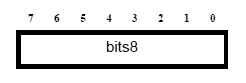
   
   bits8 Relocatable Field

   
bits16 
^^^^^^
 
Specifies 16 bits of data in a separate byte.
   
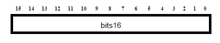
   
   bits16 Relocatable Field

   
bits24 
^^^^^^
   
Specifies 24 bits of data in a separate byte.
   
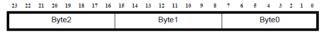

   bits24 Relocatable Field
..
   
disp7u 
^^^^^^
   
The gray areas in :numref:`disp7u_rf` represent a disp7u relocatable 
field, which specifies a seven-bit unsigned displacement within a 
16-bit instruction word, with bits 2-0 of the instruction stored in 
bits 2-0 and bits 6-3 of the instruction stored in bits 7-4.

.. _disp7u_rf:
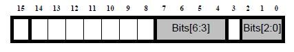

   disp7u Relocatable Field

disp9 
^^^^^
   
The gray area in :numref:`disp9_rf` represents a disp9 relocatable field, 
which specifies a nine-bit signed displacement within a 32-bit 
instruction word.

.. _disp9_rf:
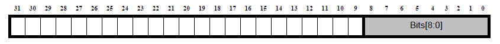

   disp9 Relocatable Field

disp9ls 
^^^^^^^

The gray areas in :numref:`disp9ls_rf` represent a disp9ls relocatable field, 
which specifies a nine-bit signed displacement within a 32-bit 
instruction word.

.. _disp9ls_rf:
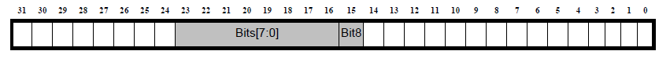

   disp9ls Relocatable Field
.. 

disp9s 
^^^^^^

The gray area in :numref:`disps_rf` represents a disp9s relocatable field, 
which specifies a 9-bit signed displacement within a 16-bit 
instruction word.

.. _disps_rf:
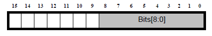

   disp9s Relocatable Field
..

disp10u 
^^^^^^^
   
The gray area in :numref:`disp10u_rf` represents a disp10u relocatable field, 
which specifies a 10-bit unsigned displacement within a 16-bit 
instruction word.

.. _disp10u_rf:
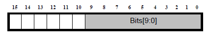

   disp10u Relocatable Field
..

disp13s 
^^^^^^^
   
The gray area in :numref:`disp_13s_rf` represents a disp13s relocatable field, 
which specifies a signed 13-bit displacement within a 16-bit 
instruction word. The displacement is to a 32-bit-aligned location 
and thus bits 0 and 1 of the displacement are not explicitly stored.

.. _disp_13s_rf:
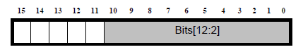

   disp13s Relocatable Field
..

disp21h 
^^^^^^^
   
The gray areas in :numref:`disp21h_rf` represent a disp21h relocatable field, 
which specifies a 21-bit signed displacement within a 32-bit 
instruction word. The displacement is to a halfword-aligned target 
location, and thus bit 0 of the displacement is not explicitly stored.
Note that the 32-bit instruction containing this relocation field may 
be either 16-bit-aligned or 32-bit-aligned.

.. _disp21h_rf:
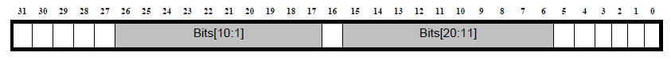

   disp21h Relocatable Field
..

disp21w 
^^^^^^^
   
The gray areas in :numref:`disp21w_rf` represent a disp21w relocatable field, 
which specifies a signed 21-bit displacement within a 32-bit 
instruction word. The displacement is to a 32-bit-aligned target 
location, and thus bits 0 and 1 of the displacement are not explicitly 
stored. 
Note that the 32-bit instruction containing this relocation 
field may be either 16-bit-aligned or 32-bit-aligned.

.. _disp21w_rf:
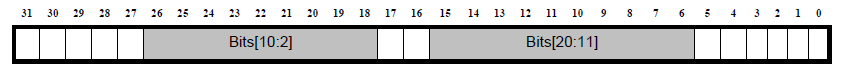

   disp21w Relocatable Field
..

disp25h 
^^^^^^^
   
The gray areas in :numref:`disp25h_rf` represent a disp25h relocatable field, 
which specifies a 25-bit signed displacement within a 32-bit 
instruction word. The displacement is to a halfword-aligned target 
location, and thus bit 0 is not explicitly stored.
Note that the 32-bit instruction containing this relocation field 
may be either 16-bit-aligned or 32-bit-aligned.

.. _disp25h_rf:
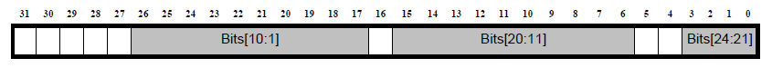

   disp25h Relocatable Field
..
    
disp25w 
^^^^^^^
   
The gray areas in :numref:`disp25w_rf` represent a disp25w relocatable field, 
which specifies a 25-bit signed displacement within a 32-bit 
instruction word. The displacement is to a 32-bit-aligned target 
location, and thus bits 0 and 1 are not explicitly stored.
Note that the 32-bit instruction containing this relocation field 
may be either 16-bit-aligned or 32-bit-aligned.

.. _disp25w_rf:
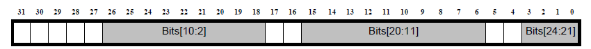

   disp25w Relocatable Field
..

disps9 
^^^^^^
   
The gray area in :numref:`disps9_rf` represents a disps9 relocatable field, 
which specifies a nine-bit signed displacement within a 16-bit 
instruction word. The displacement is to a 32-bit-aligned location, 
and thus bits 0 and 1 of the displacement are not explicitly stored. 
This means that effectively the field is bits 10-2, stored at 8-0.

.. _disps9_rf:
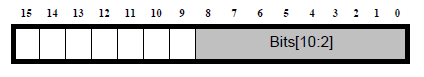

   disps9 Relocatable Field
..
    
disps12 
^^^^^^^
   
The gray areas in :numref:`disps12_rf` represent a disps12 relocatable field, 
which specifies a twelve-bit signed displacement within a 32-bit 
instruction word. The high six bits are in 0-5, and the low six bits 
are in 6-11.

.. _disps12_rf:
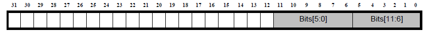

  disps12 Relocatable Field
..

word32 
^^^^^^
   
:numref:`word32_rf` specifies a 32-bit field occupying four bytes, the alignment of which 
is four bytes unless otherwise specified. See also :numref:`word32le_rf` and 
:numref:`word32be_rf`.

.. _word32_rf:
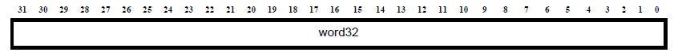

   disps12 Relocatable Field
..

word32me (Little-Endian)
^^^^^^^^^^^^^^^^^^^^^^^^
   
Specifies a 32-bit field in middle-endian Storage. Bits 31..16 are 
stored first, and bits 15..0 are stored adjacently. The individual 
halfwords are stored in the native endian orientation of the machine 
(little endian in :numref:`word32le_rf`). 

.. _word32le_rf:
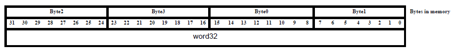

   word32me Relocatable Field on a Little-Endian Machine
..    
    
word32me (Big-Endian)
^^^^^^^^^^^^^^^^^^^^^
   
Specifies a 32-bit field in middle-endian Storage. Bits 31..16 are 
stored first, and bits 15..0 are stored adjacently. The individual 
halfwords are stored in the native endian orientation of the machine 
(big endian in :numref:`word32be_rf`). 

.. _word32be_rf:
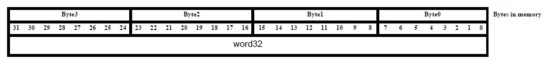

   word32me Relocatable Field on a Big-Endian Machine
..    

Relocatable-Field Calculations
~~~~~~~~~~~~~~~~~~~~~~~~~~~~~~

The calculations presented in this section assume that the actions 
transform a relocatable file into either an executable or a 
shared-object file. Conceptually, the link editor merges one or more 
relocatable files to form the output. 

The procedure is as follows:

 - Decide how to combine and locate the input files. 

 - Update the symbol values.

 - Perform the relocation. 

Relocations applied to executable or shared object files are similar 
and accomplish the same result.

The descriptions in this section use the following notation:

.. table:: Relocation Terminology  
   :widths: 30, 130
   
   =============  ===================================================================  
   **Address**    **Function**
   =============  ===================================================================	
   A              The addend used to compute the value of the relocatable field
   B              The base address at which a shared object has been loaded into 
                  memory during execution. Generally, a shared object file is 
                  built with a 0-base virtual address, but the execution address 
                  will be different.
   G              The offset into the global offset table at which the address of 
                  the relocated symbol will reside during execution.             
   GOT            The address of the global offset table
   L              The place (section offset or address) of the PLT entry for a 
                  symbol. A procedure linkage table entry redirects a function call 
                  to the proper destination. The link editor builds the initial 
                  procedure linkage table, and the dynamic linker modifies the 
                  associated GOT entries during execution.             
   MES            Middle-Endian Storage
                  A 32-bit word is stored in two halfwords, with bits 31..16 stored 
                  first and bits 15..0 stored adjacently. The individual halfwords 
                  are stored in the native endian orientation of the machine. This 
                  type of storage is used for all instructions and long immediate 
                  operands in the ARCv2 architecture.             
   P              The place (section offset or address) of the storage unit being 
                  relocated (computed using r_offset)              
   S              The value of the symbol whose index resides in the relocation entry
   SECTSTART      Start of the current section. Used in calculating offset types.
   \_SDA_BASE_    Base of the small-data area
   JLI            Base of the JLI table
   =============  ===================================================================

A relocation entry's r_offset value designates the offset or virtual address 
of the first byte of the field to be relocated. The relocation type specifies 
which bits to change and how to calculate their values. The ARCv2 architecture 
uses only Elf32_Rela relocation entries. The addend is contained in the 
relocation entry. Any data from the field to be relocated is discarded. 
In all cases, the addend and the computed result use the same byte order. 
 
.. note:: 
    With the exception of word32, all relocations with replacement fields 
    in four-byte words must be written using Middle-Endian Storage.
..

.. table:: Relocation Types
   :class: longtable
   
   ======================  ========= ========== =====================================================
   **Name**                **Value** **Field**  **Calculation**
   ======================  ========= ========== =====================================================
   R_ARC_NONE              0x0       none       none
   R_ARC_8                 0x1       bits8      S+A
   R_ARC_16                0x2       bits16     S+A
   R_ARC_24                0x3       bits24     S+A
   R_ARC_32                0x4       word32     S+A
   R_ARC_N8                0x8       bits8      A–S 
   R_ARC_N16               0x9       bits16     A–S 
   R_ARC_N24               0xa       bits24     A–S 
   R_ARC_N32               0xb       word32     P - (S+A) 
   R_ARC_SDA               0xc       disp9      S–_SDA_BASE_ +A
   R_ARC_SECTOFF           0xd       word32     (S-SECTSTART)+A
   R_ARC_S21H_PCREL        0xe       disp21h    (S+A-P)>>1 (convert to halfword displacement)
   R_ARC_S21W_PCREL        0xf       disp21w    (S+A-P)>>2 (convert to longword dis+D69placement)
   R_ARC_S25H_PCREL        0x10      disp25h    (S+A-P)>>1 (convert to halfword displacement)
   R_ARC_S25W_PCREL        0x11      disp25w    (S+A-P)>>2 (convert to longword displacement)
   R_ARC_SDA32             0x12      word32     (S+A)-_SDA_BASE_
   R_ARC_SDA_LDST          0x13      disp9ls    (S+A-_SDA_BASE_) (s9 range)
   R_ARC_SDA_LDST1         0x14      disp9ls    (S+A-_SDA_BASE_) >>1 (s10 range)
   R_ARC_SDA_LDST2         0x15      disp9ls    (S+A-_SDA_BASE_) >>2 (s11 range)
   R_ARC_SDA16_LD          0x16      disp9s     (S+A-_SDA_BASE_) (s9 range)
   R_ARC_SDA16_LD1         0x17      disp9s     (S+A-_SDA_BASE_) >>1 (s10 range)
   R_ARC_SDA16_LD2         0x18      disp9s     (S+A-_SDA_BASE_) >>2 (s11 range)
   R_ARC_S13_PCREL         0x19      disp13s    (S+A-P) >>2
   R_ARC_W                 0x1a      word32     (S+A) & ~3 (word-align)
   R_ARC_32_ME             0x1b      word32me   S+A (MES)
   R_ARC_N32_ME            0x1c      word32me   (ME (A-S))
   R_ARC_SECTOFF_ME        0x1d      word32me   (S-SECTSTART)+A (MES)
   R_ARC_SDA32_ME          0x1e      word32me   (S+A)-_SDA_BASE_ (MES)
   R_ARC_W_ME              0x1f      word32me   (S+A) & ~3 (word-aligned MES)
   R_AC_SECTOFF_U8         0x23      disp9ls    S+A-SECTSTART
   R_AC_SECTOFF_U8_1       0x24      disp9ls    (S+A-SECTSTART) >>1
   R_AC_SECTOFF_U8_2       0x25      disp9ls    (S+A-SECTSTART) >>2
   R_AC_SECTOFF_S9         0x26      disp9ls    S+A-SECTSTART - 256
   R_AC_SECTOFF_S9_1       0x27      disp9ls    (S+A-SECTSTART - 256) >>1
   R_AC_SECTOFF_S9_2       0x28      disp9ls    (S+A-SECTSTART - 256) >>2
   R_ARC_SECTOFF_ME_1      0x29      word32me   ((S-SECTSTART)+A) >>1 (MES)
   R_ARC_SECTOFF_ME_2      0x2a      word32me   ((S-SECTSTART)+A) >>2 (MES)
   R_ARC_SECTOFF_1         0x2b      word32     ((S-SECTSTART)+A) >>1 
   R_ARC_SECTOFF_2         0x2c      word32     ((S-SECTSTART)+A) >>2 
   R_ARC_SDA_12            0x2d      disps12    (S + A) - _SDA_BASE_
   R_ARC_LDI_SECTOFF1      0x2e      disp7u     (S - <ldi-table base> + A)  >> 2
   R_ARC_LDI_SECTOFF2      0x2f      disps12    (S - <ldi-table base> + A) >> 2
   R_ARC_SDA16_ST2         0x30      disps9     (S+A-_SDA_BASE) >> 2
   R_ARC_PC32              0x32      word32     S+A-P
   R_ARC_GOTPC32           0x33      word32     GOT+G+A-P
   R_ARC_PLT32             0x34      word32     L+A-P
   R_ARC_COPY              0x35      none       none
   R_ARC_GLOB_DAT          0x36      word32     S
   R_ARC_JMP_SLOT          0x37      word32     S
   R_ARC_RELATIVE          0x38      word32     B+A
   R_ARC_GOTOFF            0x39      word32     S+A-GOT
   R_ARC_GOTPC             0x3a      word32     GOT+A-P
   R_ARC_GOT32             0x3b      word32     G+A
   R_ARC_S25H_PCREL_PLT    0x3d      disp25w    L+A-P
   R_ARC_JLI_SECTOFF       0x3f      disp10u    S–JLI
   R_ARC_AOM_TOKEN_ME      0x40      word32me   AOM token (32 bits)(MES)
   R_ARC_AOM_TOKEN         0x41      word32     AOM token (32 bits)
   R_ARC_TLS_DTPMOD        0X42      
   R_ARC_TLS_DTPOFF        0X43      
   R_ARC_TLS_TPOFF         0x44      
   R_ARC_TLS_GD_GOT        0x45      
   R_ARC_TLS_GD_LD         0X46      
   R_ARC_TLS_GD_CALL       0X47      
   R_ARC_TLS_IE_GOT        0X48      
   R_ARC_TLS_DTPOFF_S9     0X49      
   R_ARC_TLS_LE_S9         0X4A      
   R_ARC_TLS_LE_32         0X4B      
   R_ARC_S25W_PCREL_PLT    0x4c      disp25w    L+A-P
   R_ARC_S21H_PCREL_PLT    0x4d      disp21h    L+A-P
   ======================  ========= ========== =====================================================
..

A relocation entry's r_offset value designates the offset or virtual address of 
the first byte of the field to be relocated. The relocation type specifies which 
bits to change and how to calculate their values. The ARCv2 architecture uses only 
Elf32_Rela relocation entries. The addend is contained in the relocation entry. 
Any data from the field to be relocated is discarded. In all cases, the addend and 
the computed result use the same byte order. 
 
.. note::
   With the exception of word32, all relocations with replacement fields in 
   four-byte words must be written using Middle-Endian Storage.
..

**R_ARC_S21H_PCREL**

This relocation type is used with conditional branches, for example: 

.. code::

   bne label
..

**R_ARC_S21W_PCREL**

This relocation type is used with conditional branch and link, for example: 

.. code::

   blne label
..

**R_ARC_S25H_PCREL**

This relocation type is used with unconditional branches, for example: 

.. code::

   b label
..

**R_ARC_S25W_PCREL**

This relocation type is used with unconditional branch and link, for example: 

.. code::

   bl printf
..

**R_ARC_SDA32**

This relocation type is used with 32-bit small-data fixups, for example:

.. code::

   add   r0, gp, var@sda
..

**R_ARC_SDA_LDST\***

The R_ARC_SDA_LDST* relocation types are used with small-data fixups on 
loads and stores. Examples:

.. code::

   ldb   r0,  [gp, var@sda]   ; R_ARC_SDA_LDST
   stw   r0,  [gp, var@sda]   ; R_ARC_SDA_LDST1
   ld    r0,  [gp, var@sda]   ; R_ARC_SDA_LDST2
..

**R_ARC_SDA16_LD\***

The R_ARC_SDA16_LD* relocation types are used with 16-bit GP-relative load 
instructions, when such instructions load a small-data variable relative 
to the GP. Examples:

.. code::

   ldb_s  r0, [gp, var@sda]   ; R_ARC_SDA16_LD
   ldw_s  r0, [gp, var@sda]   ; R_ARC_SDA16_LD1
   ld_s   r0, [gp, var@sda]   ; R_ARC_SDA16_LD2
..

**R_ARC_S13_PCREL**

This relocation type is used with 16-bit branch and link, for example:

.. code::

   bl_s printf
..

**R_ARC_W**

This relocation type is used to ensure 32-bit alignment of a fixup value. 
Examples:

.. code::

   mov   r0,  var@l
   ld    r0, [pcl, lab - .@l]
..

**R_ARC_\*_ME**

Relocation types ending in _ME behave like the non-ME relocation type of 
the same name, with the exception that they use Middle-Endian Storage: A 
32-bit word is stored in two halfwords, with bits 31..16 stored first 
and bits 15..0 stored adjacently. The individual halfwords are stored in 
the native endian orientation of the machine. That is, the upper halfwords 
both have bits 31..16, but they are in a different sequence between big 
and little endian. 

This type of storage is used for all instructions and long immediate 
operands in the ARCv2 architecture.

**R_AC_SECTOFF\***

The R_AC_SECTOFF* relocation types allow a section-relative offset for 
ARCv2 loads and stores in the short-immediate-operand range of 0 to 255 
(-256 to -255 for the S9 variety), so long as the base register is loaded 
with the address of the section. Addressing may be scaled such that the 
range for halfwords is 0 to 510 (-256 to -510) and the range for 32-bit 
word accesses is 0 to 1020 (-256 to -1020), with byte accesses retaining 
the range 0 to 255 or -256 to -255. Examples:

.. code::

   ldb  r0, [r20, var@sectoff_u8]   ; R_AC_SECTOFF_U8
   stw  r0, [r20, var@sectoff_u8]   ; R_AC_SECTOFF_U8_1
   ld   r0, [r20, var@sectoff_u8]   ; R_AC_SECTOFF_U8_2
   ldb  r0, [r20, var@sectoff_s9]   ; R_AC_SECTOFF_S9
   stw  r0, [r20, var@sectoff_s9]   ; R_AC_SECTOFF_S9_1
   ld   r0, [r20, var@sectoff_s9]   ; R_AC_SECTOFF_S9_2
..

.. note::
   The ninth bit of the replacement field is not used for the following 
   relocation types:
   - R_AC_SECTOFF_U8
   - R_AC_SECTOFF_U8_1
   - R_AC_SECTOFF_U8_2
..

**R_ARC_SECTOFF\***

The R_ARC_SECTOFF* relocation types are used with section-relative 
offset loads and stores from or to XY memory. 

**R_ARC_GOTPC32**

This relocation type is used to obtain a PC-relative reference to 
the GOT entry for a symbol. This type is used for the same purpose 
as R_ARC_GOT32 but uses PC-relative addressing to reference the GOT 
whereas type R_ARC_GOT32 is typically used with a base register 
containing the address of the GOT. Example:

.. code::

   ld r0, [pcl, var@gotpc]

**R_ARC_PLT32**
 
This relocation type computes the address of the symbol's PLT entry 
and additionally instructs the link editor to build a procedure 
linkage table. This relocation type is usually not explicitly needed, 
as the link editor converts function calls to use this type when 
building a shared library or dynamic executable. Example:

.. code::

   bl func@plt

**R_ARC_COPY**
 
The link editor creates this relocation type for dynamic linking. Its 
offset member refers to a location in a writable segment. The symbol 
table index specifies a symbol that should exist both in the current 
object file and in a shared object. During execution, the dynamic 
linker copies data associated with the shared object's symbol to the 
location specified by the offset. 

**R_ARC_GLOB_DAT**
 
The link editor creates this relocation type for dynamic linking. This 
relocation type is used to set a global offset table entry to the address 
of the specified symbol. The special relocation type allows one to 
determine the correspondence between symbols and global offset table 
entries. 

**R_ARC_JMP_SLOT**
 
The link editor creates this relocation type for dynamic linking. Its 
offset member gives the location of a PLT’s GOT entry. The dynamic 
linker modifies the GOT entry so that the PLT will transfer control to 
the designated symbol's address. 

You might add examples after implementation is finished (mj, 1/05).

**R_ARC_RELATIVE** 

The link editor creates this relocation type for dynamic linking. Its 
offset member gives a location within a shared object that contains a 
value representing a relative address. The dynamic linker computes the 
corresponding virtual address by adding the virtual address at which 
the shared object was loaded to the relative address. Relocation entries 
for this type must specify 0 for the symbol table index.
 
**R_ARC_GOTOFF**
 
This relocation type computes the difference between a symbol's value 
and the address of the global offset table. It additionally instructs 
the link editor to build the global offset table. This relocation type 
is not used for loading from the contents of the GOT, but to use the 
global data pointer anchored at the GOT to access other nearby data. 

Example:

.. code::

   add r0, gp, var@gotoff

**R_ARC_GOTPC**
 
This relocation type resembles R_ARC_PC32, except it uses the address 
of the global offset table in its calculation. The symbol referenced 
in this relocation is _GLOBAL_OFFSET_TABLE_, which additionally 
instructs the link editor to build the global offset table. This 
relocation type provides a PC-relative means of obtaining the address 
of the global offset table. Example: 

.. code::

   add gp, pcl, _GLOBAL_OFFSET_TABLE_@gotpc

   
Relocation Table
~~~~~~~~~~~~~~~~
.. code::

   # Generic
   #Relocation.new("R_ARC_NONE         0x0   none      bitfield    none")
   Relocation.new("R_ARC_8             0x1   bits8     bitfield    S+A")
   Relocation.new("R_ARC_16            0x2   bits16    bitfield    S+A")
   Relocation.new("R_ARC_24            0x3   bits24    bitfield    S+A")
   Relocation.new("R_ARC_32            0x4   word32    bitfield    S+A")
   
   # Unsupported
   Relocation.new("R_ARC_N8            0x8   bits8     bitfield    A-S")
   Relocation.new("R_ARC_N16           0x9   bits16    bitfield    A-S")
   Relocation.new("R_ARC_N24           0xa   bits24    bitfield    A-S")
   Relocation.new("R_ARC_N32           0xb   word32    bitfield    A-S")
   Relocation.new("R_ARC_SDA           0xc   disp9     bitfield    ME(S+A-_SDA_BASE_)")
   Relocation.new("R_ARC_SECTOFF       0xd   word32    bitfield    (S-SECTSTART)+A")
   
   # arcompact elf me reloc
   Relocation.new("R_ARC_S21H_PCREL    0xe   disp21h   signed      ME((S+A-P)>>1) (convert to halfword displacement)")
   Relocation.new("R_ARC_S21W_PCREL    0xf   disp21w   signed      ME((S+A-P)>>2) (convert to longword displacement)")
   Relocation.new("R_ARC_S25H_PCREL    0x10  disp25h   signed      ME((S+A-P)>>1) (convert to halfword displacement)")
   Relocation.new("R_ARC_S25W_PCREL    0x11  disp25w   signed      ME((S+A-P)>>2) (convert to longword displacement)")
   Relocation.new("R_ARC_SDA32         0x12  word32    signed      ME((S+A)-_SDA_BASE_)")
   Relocation.new("R_ARC_SDA_LDST      0x13  disp9ls   signed      ME((S+A-_SDA_BASE_)) (s9 range)")
   Relocation.new("R_ARC_SDA_LDST1     0x14  disp9ls   signed      ME((S+A-_SDA_BASE_)>>1) (s10 range)")
   Relocation.new("R_ARC_SDA_LDST2     0x15  disp9ls   signed      ME((S+A-_SDA_BASE_)>>2) (s11 range)")
   
   # Short instructions should no be marked as ME
   Relocation.new("R_ARC_SDA16_LD      0x16  disp9s    signed      (S+A-_SDA_BASE_) (s9 range)")
   Relocation.new("R_ARC_SDA16_LD1     0x17  disp9s    signed      (S+A-_SDA_BASE_)>>1 (s10 range)")
   Relocation.new("R_ARC_SDA16_LD2     0x18  disp9s    signed      (S+A-_SDA_BASE_)>>2 (s11 range)")
   Relocation.new("R_ARC_S13_PCREL     0x19  disp13s   signed      ((S+A-P)>>2)")
   
   # Unsupported
   Relocation.new("R_ARC_W             0x1a  word32    bitfield    (S+A)&~3 (word-align)")
   
   # arcompact elf me reloc
   Relocation.new("R_ARC_32_ME         0x1b  limm      signed      ME(S+A) (MES)")
   
   # TODO: This is a test relocation
   Relocation.new("R_ARC_32_ME_S       0x69  limms     signed      ME(S+A) (MES)")
   
   # Unsupported
   Relocation.new("R_ARC_N32_ME        0x1c  word32    bitfield    ME(A-S) (MES)")
   Relocation.new("R_ARC_SECTOFF_ME    0x1d  word32    bitfield    ME((S-SECTSTART)+A) (MES)")
   
   # arcompact elf me reloc
   Relocation.new("R_ARC_SDA32_ME      0x1e  limm      signed      (S+A-_SDA_BASE_)")
   
   # Unsupported
   Relocation.new("R_ARC_W_ME          0x1f  word32    bitfield    ME((S+A)&~3) (word-aligned MES)")
   Relocation.new("R_AC_SECTOFF_U8     0x23  disp9ls   bitfield    ME(S+A-SECTSTART)")
   Relocation.new("R_AC_SECTOFF_U8_1   0x24  disp9ls   bitfield    ME((S+A-SECTSTART)>>1)")
   Relocation.new("R_AC_SECTOFF_U8_2   0x25  disp9ls   bitfield    ME((S+A-SECTSTART)>>2)")
   
   Relocation.new("R_AC_SECTOFF_S9     0x26  disp9ls   bitfield    ME(S+A-SECTSTART-256)")
   Relocation.new("R_AC_SECTOFF_S9_1   0x27  disp9ls   bitfield    ME((S+A-SECTSTART-256)>>1)")
   Relocation.new("R_AC_SECTOFF_S9_2   0x28  disp9ls   bitfield    ME((S+A-SECTSTART-256)>>2)")
   
   
   Relocation.new("R_ARC_SECTOFF_ME_1  0x29  word32    bitfield    ME(((S-SECTSTART)+A)>>1) (MES)")
   Relocation.new("R_ARC_SECTOFF_ME_2  0x2a  word32    bitfield    ME(((S-SECTSTART)+A)>>2) (MES)")
   Relocation.new("R_ARC_SECTOFF_1     0x2b  word32    bitfield    ((S-SECTSTART)+A)>>1")
   Relocation.new("R_ARC_SECTOFF_2     0x2c  word32    bitfield    ((S-SECTSTART)+A)>>2")
   
   Relocation.new("R_ARC_SDA_12        0x2d  disp12s   signed      (S+A-_SDA_BASE_)")
   
   Relocation.new("R_ARC_SDA16_ST2     0x30  disp9s1   signed      (S+A-_SDA_BASE_)>>2 (Dsiambiguation for several relocations)")
   
   # arcompact elf me reloc
   Relocation.new("R_ARC_32_PCREL      0x31  word32    signed      S+A-PDATA")
   Relocation.new("R_ARC_PC32          0x32  word32    signed      ME(S+A-P)")
   
   # Special
   Relocation.new("R_ARC_GOT32         0x3b  word32    dont        G+A") # == Special
   
   # arcompact elf me reloc
   Relocation.new("R_ARC_GOTPC32       0x33  word32    signed      ME(GOT+G+A-P)")
   Relocation.new("R_ARC_PLT32         0x34  word32    signed      ME(L+A-P)")
   Relocation.new("R_ARC_COPY          0x35  none      signed      none")
   Relocation.new("R_ARC_GLOB_DAT      0x36  word32    signed      S")
   Relocation.new("R_ARC_JMP_SLOT      0x37  word32    signed      ME(S)")
   Relocation.new("R_ARC_RELATIVE      0x38  word32    signed      ME(B+A)")
   Relocation.new("R_ARC_GOTOFF        0x39  word32    signed      ME(S+A-GOT)")
   Relocation.new("R_ARC_GOTPC         0x3a  word32    signed      ME(GOT_BEGIN-P)")
   
   Relocation.new("R_ARC_S21W_PCREL_PLT  0x3c  disp21w    signed      ME((L+A-P)>>2)")
   Relocation.new("R_ARC_S25H_PCREL_PLT  0x3d  disp25h    signed      ME((L+A-P)>>1)")
   
   # WITH TLS
   Relocation.new("R_ARC_TLS_DTPMOD    0x42  word32    dont        0") # , 0, 2, 32, FALSE, 0, arcompact_elf_me_reloc, "R_ARC_TLS_DTPOFF",-1),
   Relocation.new("R_ARC_TLS_TPOFF     0x44  word32    dont        0") # ,"R_ARC_TLS_TPOFF"),
   Relocation.new("R_ARC_TLS_GD_GOT    0x45  word32    dont        ME(G+GOT-P)") # , 0, 2, 32, FALSE, 0, arcompact_elf_me_reloc, "R_ARC_TLS_GD_GOT",-1),
   Relocation.new("R_ARC_TLS_GD_LD     0x46  none      dont        0") # ,"R_ARC_TLS_GD_LD"),
   Relocation.new("R_ARC_TLS_GD_CALL   0x47  word32    dont        0") # ,"R_ARC_TLS_GD_CALL"),
   Relocation.new("R_ARC_TLS_IE_GOT    0x48  word32    dont        ME(G+GOT-P)") # , 0, 2, 32, FALSE, 0, arcompact_elf_me_reloc, "R_ARC_TLS_IE_GOT",-1),
   Relocation.new("R_ARC_TLS_DTPOFF    0x43  word32    dont        ME(S-SECTSTART+A)") # , 0, 2, 32, FALSE, 0, arcompact_elf_me_reloc, "R_ARC_TLS_DTPOFF",-1),
   Relocation.new("R_ARC_TLS_DTPOFF_S9 0x49  word32    dont        ME(S-SECTSTART+A)") # , 0, 2, 32, FALSE, 0, arcompact_elf_me_reloc, "R_ARC_TLS_DTPOFF_S9",-1),
   Relocation.new("R_ARC_TLS_LE_S9     0x4a  word32    dont        ME(S+TCB_SIZE-TLS_REL)") # , 0, 2, 9, FALSE, 0, arcompact_elf_me_reloc, "R_ARC_TLS_LE_S9",-1),
   Relocation.new("R_ARC_TLS_LE_32     0x4b  word32    dont        ME(S+A+TCB_SIZE-TLS_REL)") # , 0, 2, 32, FALSE, 0, arcompact_elf_me_reloc, "R_ARC_TLS_LE_32",-1),
   # WITHOUT TLS
   
   Relocation.new("R_ARC_S25W_PCREL_PLT         0x4c  disp25w    signed      ME((L+A-P)>>2)")
   Relocation.new("R_ARC_S21H_PCREL_PLT         0x4d  disp21h    signed      ME((L+A-P)>>1)")   
..
    
 
